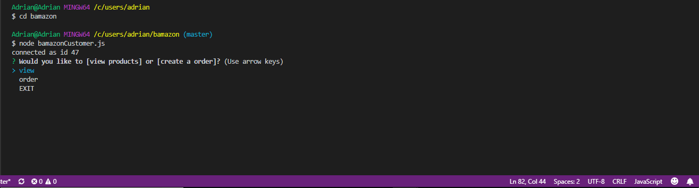
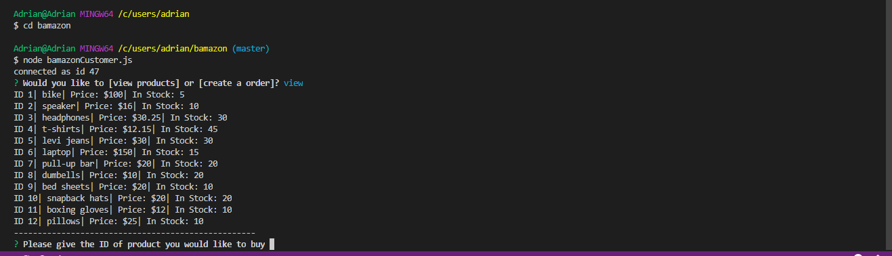
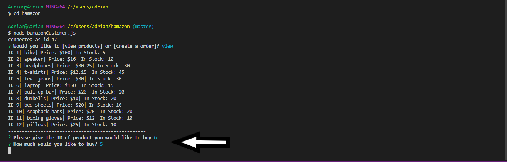

# bamazon

## What this project does:

Bamazon uses a database to keep track of information of items for sale. User is able to create order for multiple items and track total cost.
App will also keep track stock levles for each item avilable for sale in database.  

## Why the project is useful:

It allows user to look through group of available items for sale. It also provides inventory levels, and pricing for each item.
User is able to create a order in only a few questions.

## Who Maintains the project:
* Adrian Peña 

## How it works:

## START

When you first run the app, a connection is made and a ID is given to user in order to track their session.
To start the app a question is asked to allow the user to either view the product list that is availale, end the session, or create their order.

## Product List

IF users chooses the view option the are given the full list of prudcts availble in the inventory.
THis includes the items ID number, price, and inventory stock.
After product list is shown the app continues on to creating order.

## Create Order

Once you know what you want, you create the oder. Two questions will be asked by app.
"What item you wish to purchase?" and "how much of it?"
By answering these two questions the app is able to calculate your total cost and decrease inventory levels. 

